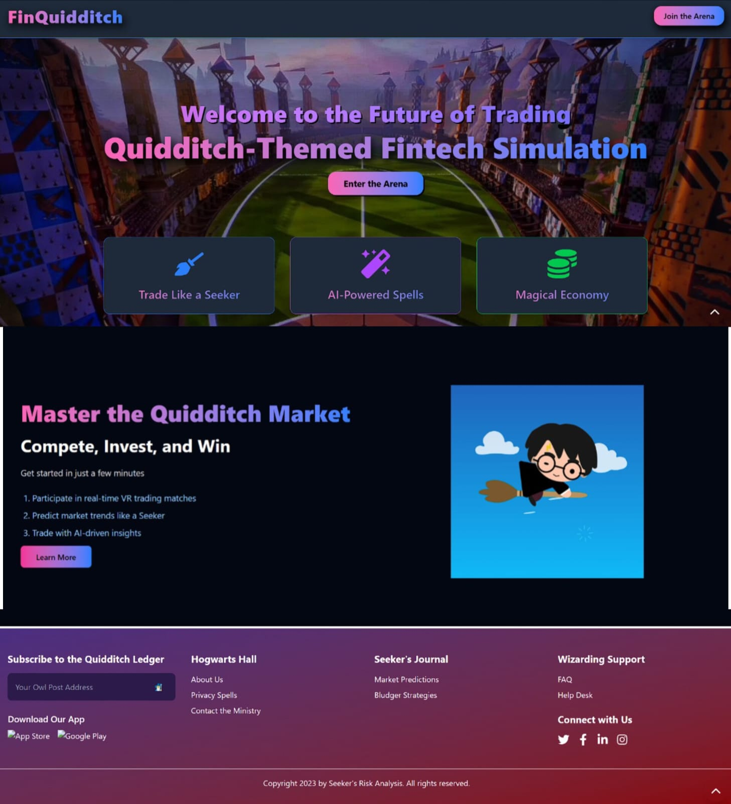
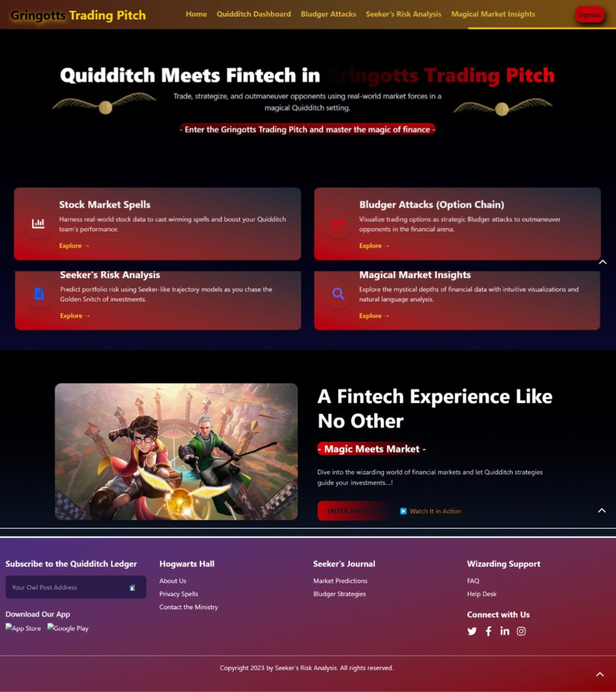
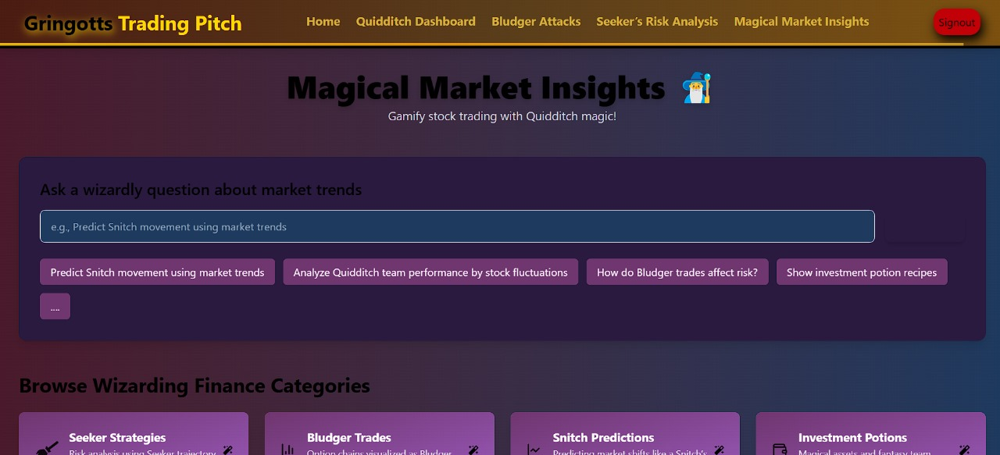
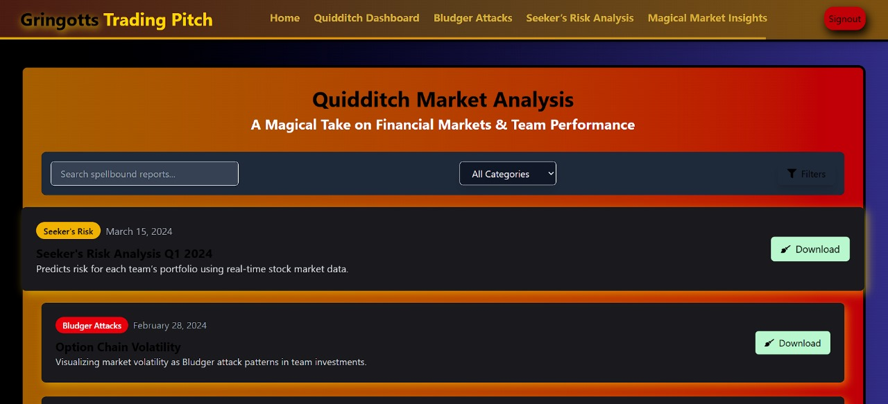
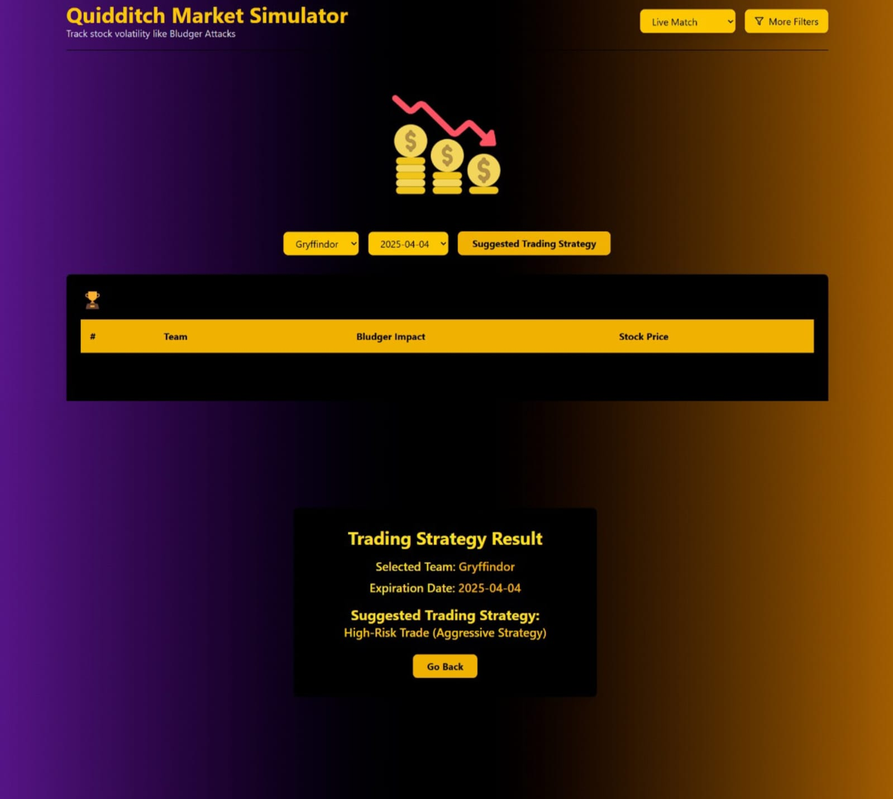
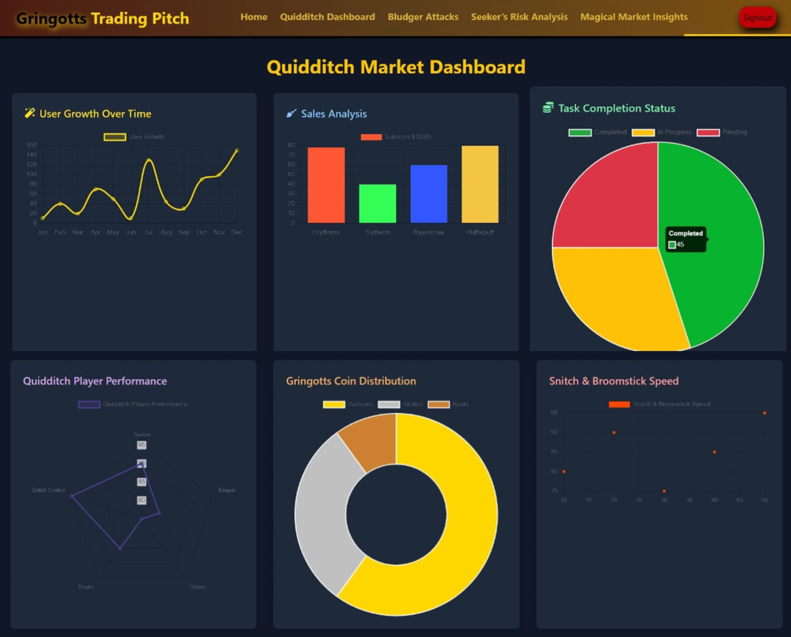
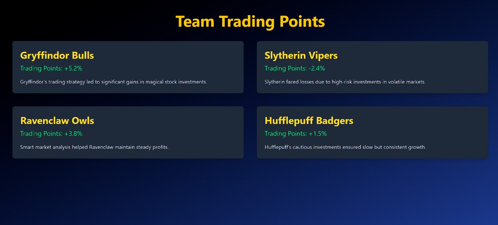
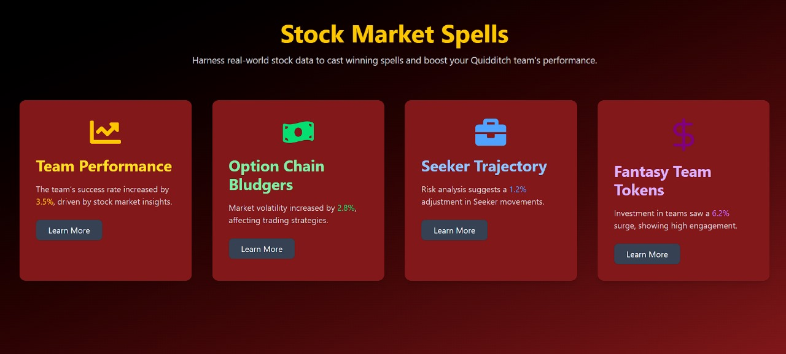

# 🧙‍♂️ Gringotts Trading Pitch

A fantasy-powered FinTech prototype inspired by the world of Harry Potter — where stock market trading meets game-like decisions, real-time AI, and magical strategy.

🏆 **Winner** - HackFest Advaita 2K25  
📍 Hosted at IIIT Bhubaneswar | March 29, 2025  
🥇 Secured 1st place among 60+ competing teams in just 12 hours of rapid development.

---

## 🚀 Overview

Gringotts Trading Pitch is a gamified stock market simulator that uses live data, AI predictions, and fantasy game mechanics to create a fun, engaging financial trading experience.

It blends the thrill of real-time financial trading with the charm of fantasy storytelling and smart machine learning.

---

## 🧩 Key Features

- 📈 Real-time stock market data analysis  
- 🔮 Seeker movement prediction using market volatility  
- 📊 Portfolio risk assessment with ML models  
- 🎮 Gamified trading simulation inspired by fantasy sports  
- 🧙‍♀️ Magic spells as data-driven trading decisions  
- 🧠 Interactive dashboards and AI-powered insights  

---

## 🧠 Technologies Used

- Python (Flask)
- Machine Learning (Scikit-learn, TensorFlow)
- Deep Learning (Keras)
- Data Visualization (Matplotlib, Plotly)
- Pandas, NumPy
- HTML, CSS, JavaScript

---

## 🧪 Folder Structure

```
Gringotts-Trading-Pitch/
├── Frontend/
├── stockpy/
├── stock data.csv
├── main.py
├── Istm stock model.h5
├── DailyRetum.ipynb
├── OptionChain.ipynb
├── Risk Analysis.ipynb
├── Trajectory Prediction.ipynb
├── .gitignore
├── LICENSE
├── README.md
├── static/
│   ├── 1.home.jpg
│   ├── 2.b.jpg
│   ├── 3.marketinsights.jpg
│   ├── 4.market_analysis.jpg
│   ├── 5.market_simulation.jpg
│   ├── 6.analysis.jpg
│   ├── 7.team_trading.jpg
│   ├── 8.stockmarketspells.jpg
│   ├── 9predection check.jpg
```

---

## 📷 Screenshots

### 🏠 1. Home Page  
Welcome screen to the magical financial experience.  


---

### 📊 2. Market Overview  
Displays real-time market updates with interactive graphs.  


---

### 🧠 3. Market Insights  
AI-generated insights on current market dynamics.  


---

### 📉 4. Market Analysis  
Visual and statistical breakdown of market volatility.  


---

### 🎮 5. Market Simulation  
Fantasy-based trading interface that simulates magical financial decisions.  


---

### 📈 6. Risk Analysis  
Risk profiling for different assets and portfolios.  


---

### 🤝 7. Team-Based Trading  
Fantasy-style team collaboration for smarter trades.  


---

### 🧙‍♂️ 8. Market Spells  
Special AI-driven “spells” to assist or hinder trades.  


---

### 🔮 9. Prediction Accuracy  
Checks the effectiveness and accuracy of AI predictions.  


---

## 👨‍💻 Author & Contributors

- **AI & ML Lead**: *Manohar Kumar*  
- **Team**: Susmita Das, Prakash Sahoo, Vikash Kumar Adhikari  
- **Mentor**: *Dr. Satya Ranjan Pattanaik*  
- **Special Thanks**: Sudheer Kumar N (Former Director, ISRO)

---

## 🪄 Special Recognition

Our project was personally appreciated by **Sudheer Kumar N Sir**, Former Director at ISRO, for its unique combination of Finance, AI, and Fantasy.

---

## 📜 License

This project is licensed under the MIT License - see the [LICENSE](LICENSE) file for details.

---

> 💡 *Imagination + Code = Real-World Impact*
